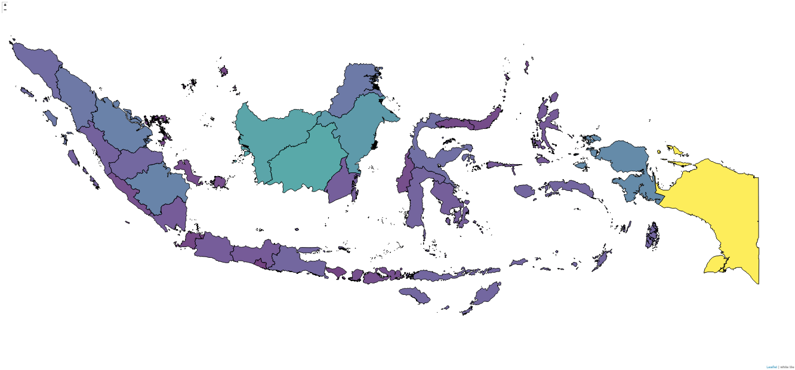

# choroplethMap_Indonesia
Choropleth map of Indonesia with Python and folium.

Here is the screenshot from the choropleth map. The color based on total area of each province using viridis colormap.

### Convert shapefile to GeoJSON and vice versa
The GeoJSON file that I use to create the choropleth map can't be upload to github due to its size (~ 42 Mb). Instead, I upload the shapefile that I use to create the GeoJSON file. 
In the zip file, it contains the shapefile (.shp) and other necessary file (.prj, .dbx, .shx).  
How to convert it?
* Go to [mapshaper](https://mapshaper.org), upload the zip file, or you can only upload the .shp, .prj, and .dbf file to create a map.
* Then it will show you the actual map base on the uploaded .shp/GeoJSON file.
* Export the map to the desired file type (shapefile, GeoJSON, etc)
